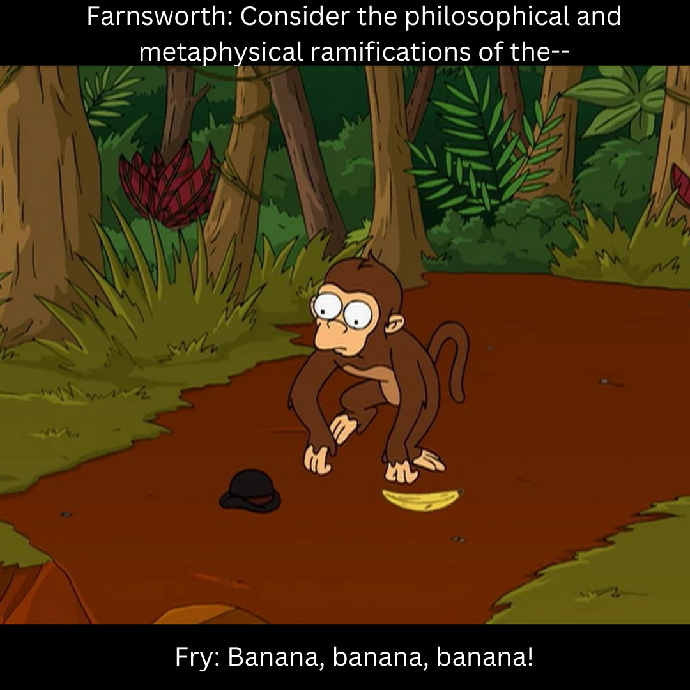

First project of this post-university program.

For our debut, we chose a dataset of banana images with the goal of developing a Machine Learning system to identify the ripeness level of bananas.

The webpage can be found here: https://universe.roboflow.com/zd7y6xooqnh7wc160ae7/banana-ripeness-classification

Want to know more? Take a look at the final report, where we explain in detail what we did and explore some possible real-world applications (hopefully nobody will steal our idea :) ).

Will we manage to pick the right banana, or will we end up like Guenter?

### Contenuto del repository:
- `Banana_Ripeness_Recognition_System.ipynb`: Google Colab notebook
- `Fruit Ripeness Monitoring System for Smart Kitchen`: final report
- `Group_Project_Image_Recognition_Business_Application`: task assignment